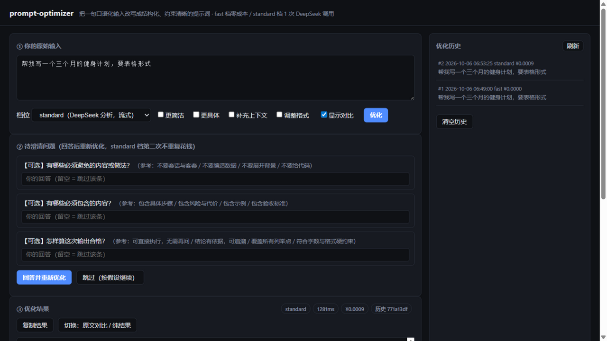

# prompt-optimizer

把用户的一句原始输入，改写为**结构化、意图明确、约束清晰**的提示词。

<p align="center">
  
</p>

[](https://github.com/wtskd/prompt-optimizer/actions/workflows/ci.yml)


**为什么是这个形态**：多数"提示词优化器"是把你的话丢给 LLM 重写一遍——结果不可复现、不可审计、每次都花钱。本项目反过来：**LLM 只负责"看懂"（意图分类 + 槽位抽取），改写本身由确定性代码完成**，因此输出可回放、可 diff、可离线（fast 档零成本毫秒级），并且有一整套留出集评测在盯着数字。

| 档位 | LLM 调用 | 成本 | 定位 |
|---|---|---|---|
| `fast` | 0 | ¥0，毫秒级 | 纯规则 + 模板，**架构主干**，不是降级版 |
| `standard` | 1 次 | ≈¥0.001/条 | DeepSeek 只做"看懂"，其余 100% 确定性代码 |
| `deep` | 3 次 | ≈¥0.004/条 | 基础分析 + 槽位补全 + 对抗性自检；每跳独立缓存/计费/留痕，**不做静默降级** |

**功能一览**：三档位管线（S1–S8 + deep 三跳）· 多轮澄清闭环 · 自定义优化目标（更简洁/更具体/补充上下文/调整格式）· 输入语言一致性 · SSE 流式 · 优化历史 · 行级对比 · 一键复制 · 零依赖 Web 宿主

> 下面的文档保持工程视角：设计分层、评测口径、不变量与诚实清单。

这是 `docs/prompt-optimizer-plugin-design.md` 设计实现的**第一层主干 + 第二层适配器 + 评测闭环**。

## 快速开始

```bash
# Fast 档：0 次 LLM 调用、零成本、毫秒级
node src/cli.js "帮我做一个三个月的健身计划，要表格形式"
node src/cli.js --json "把这份周报改写成三点式清单，不超过 200 字"
node src/cli.js --ask "帮我写点东西"        # 打开追问分支（默认不追问，全部转成带依据的假设）
node src/cli.js --json --ask --answers '{"deliverable_format":"表格"}' "帮我写点东西"   # 回收上一轮追问的回答
node src/cli.js --json --ask --answers-file answers.json "帮我写点东西"                 # 回答较多时写文件（与 --answers 互斥）
node src/cli.js --model reasoning "写一份技术方案"
echo "从这段话里提取出所有日期，输出 JSON" | node src/cli.js

# Standard 档：需要 API key；LLM 只做意图与槽位分析
export DEEPSEEK_API_KEY=sk-xxx             # Windows PowerShell: $env:DEEPSEEK_API_KEY='sk-xxx'
node src/cli.js --tier standard "帮我看看这个报错到底啥原因"      # 单次约 ¥0.0009（deepseek-chat）
node src/cli.js --tier standard --max-cost 0.1 "写个周报"

# 浏览器插件（MV3，与 CLI/Web 宿主共用同一份确定性管线）
# 安装：chrome://extensions → 开发者模式 → 加载已解压的扩展程序 → 选 extension/ 目录
# key 只存本机 chrome.storage；fast 档无需 key；详见 extension/README.md

# 常用功能旗标（两档通用，goal 只影响渲染层、零成本）
node src/cli.js --goal concise,format "帮我写周报"   # 自定义优化目标：concise|specific|context|format
node src/cli.js --tier standard --stream "写个爬虫"  # 流式看模型分析过程（打到 stderr，stdout 可管道）
node src/cli.js --diff "帮我写周报"                  # 原文 vs 结果的逐行对比
node src/cli.js --copy "帮我写周报"                  # 结果复制到剪贴板
node src/cli.js --history 10                         # 优化历史（默认每次自动存档）
node src/cli.js --history-show 3                     # 看第 3 条完整记录
node src/cli.js --no-save --goal specific "..."      # 本次不存历史
```

Web 宿主（本地起服务，浏览器里完成"输入 → 流式分析 → 结果/对比/复制 → 澄清追问 → 历史"全流程）：

```bash
npm start                       # 等价于 node src/server.js，默认 http://localhost:8787
PORT=9000 npm start             # 自定义端口
# API key 仍从环境变量读取（DEEPSEEK_API_KEY 等），只留在服务端，绝不发给浏览器
```

常用命令：

```bash
npm test                  # node --test test/（标准做法）
npm run test:files        # 沙箱/受限环境备用：直接逐个执行 9 个测试文件（含 clarify-round / llm / llm-merge）
npm run eval              # 盲测集 30 条：准确率 + 可信度分层 + 基线记录/漂移比对
npm run eval:diff         # 与 baseline.fast.json 比对漂移
npm run eval:local        # 用你自己的真实输入建专属基线（见 evals/README.md）
npm run eval:holdout      # 独立留出集（20 条从未跑过的输入）fast 档
npm run eval:holdout:standard  # 留出集真实跑一遍（≈¥0.02）→ baseline.standard.holdout.json
npm run eval:holdout:compare   # 留出集 Fast vs Standard 逐样本对照
npm run eval:holdout2          # 第二留出集（holdout2.jsonl，v01–v20）fast 档
npm run eval:holdout2:standard # 第二留出集真实跑一遍（≈¥0.02）→ baseline.standard.holdout2.json
npm run eval:estimate     # 只估费不发请求：standard 档跑完你的集合要花多少钱
npm run eval:mock         # 离线 mock 跑 standard 档链路（前 6 条，0 真实请求）
npm run eval:compare      # 两份快照对照（fast → standard 的逐样本增益）
npm run eval:recompute    # 标签修订后 0 成本重出指标（用快照里已记录的预测重算，不再调模型）
```

> 受限沙箱注意：`node --test test/` 会派生子进程 runner，在禁止管道 stdio 的沙箱里会报
> `spawn EPERM`。此时改用 `npm run test:files`，node:test 在主进程内执行，不派生子进程。

当前实测结果（Node v22.23.3）：

```text
单测                    : 57/57 通过（intent-slots 6、clarify 5、clarify-round 10、conflict-rules 6、e2e 8、llm 15、llm-merge 7）
意图准确率（dev 集）    : 100.0% (20/20)   ← 自证：正则就是照着它写的
意图准确率（盲测 30 条）: 26.7% (8/30)     ← Fast 档；"错且自信" 2
意图准确率（真实 20 条，Fast）  : 25.0% 严格 / 30.0% 含可接受替代
意图准确率（留出集 20 条，Fast）: 5.0% 严格 / 15.0% 含可接受替代  ← 规则层泛化极差（12 条无信号回退）
意图准确率（holdout2 20 条，Fast）: 5.0% 严格 / 5.0% 含可接受替代  ← 论坛长句，19/20 落进 write 兜底
意图准确率（holdout3 20 条，Fast）: 10.0% 严格 / 20.0% 含可接受替代  ← 无信号回退 8
意图准确率（holdout4 20 条，Fast）: 10.0% 严格 / 20.0% 含可接受替代  ← 无信号回退 13
意图准确率（holdout5 15 条，Fast）: 0.0% 严格 / 0.0% 含可接受替代   ← 15 条全低置信、10 条无信号回退
Standard（真实 20 条）  : 意图 80.0% 严格 / 90.0% 含替代、形态 100% (5/5)、可直接采用率 80.0%
                          "错且自信" 2（u04/u11）、0 降级、0 违规、花费 ¥0.0185
Standard（留出集 20 条）: 改提示词前 35.0% / 45.0%（"错且自信" 11）→ 改提示词后 80.0% / 95.0%
                          （"错且自信" 1、可直接采用率 75.0%），花费 ¥0.0177 + ¥0.0194
Standard（holdout2 20 条）: 90.0% 严格 / 90.0% 含替代、形态 n/a、可直接采用率 80.0%、
                          0 降级、0 违规、花费 ¥0.0195（20 次调用 / 0 缓存、870.4 ms 含往返）
Standard（holdout3 20 条）: 70.0% 严格 / 90.0% 含替代、可直接采用率 50.0%、"错且自信" 2（w05/w16）、
                           0 降级、0 违规、花费 ¥0.0236（20 次调用、880.1 ms）← 触发判据回滚条件
Standard（holdout4 · 受控 A/B）: 引擎 v1.1 → **50.0%/65.0%**（"错且自信" 7）→ 引擎 v1.2 **75.0%/95.0%**
                           （"错且自信" 1 = x09、可直接采用率 55.0%），花费 ¥0.0253 + ¥0.0278、1247.5 → 1111.6 ms
                           ← **样本内数字**：v1.2 是看过 A 臂失败模式后写的，不构成泛化证据
Standard（holdout5 15 条）: 66.7% 严格 / 80.0% 含替代、可直接采用率 66.7%、"错且自信" 3（z03/z10/z11）、
                           0 降级、0 违规、花费 ¥0.0184（15 次调用、1016.1 ms）← **唯一一次干净量到 v1.2 的泛化**
Standard（离线 mock）   : 意图 83.3% (5/6) ← mock 只证明链路可用，不是效果结论
多轮澄清                : 回答回收闭环已落地；`--answers` 回答后该槽位缺口归零、不再进假设也不再被追问
确定性                  : 100.0%（fast/mock 两次运行 promptHash 一致；真实 standard 记 n/a——重跑要花钱）
平均单次耗时            : 0.3–0.4 ms（Fast 档本地）/ 843–1016 ms（Standard 档含模型往返，预算 3000 ms）
不变量违规              : 0
标签口径                : inputs.local / holdout / holdout2 / holdout3 / holdout4 / holdout5 都过了独立标注员盲标复核
                          （evals/ANNOTATION.md 第 5、6.1–6.5 节），裁定一律早于跑引擎
Standard 档真实端点调用 : 约 193 次请求 + 2 次缓存命中 ≈ 195 条样本，合计 ¥0.1863（≈¥0.0009/条）
                          （含一次因字段名不匹配造成的假跑 ¥0.0007，见 AGENTS.md 铁律 7）
```

**数字怎么读**：dev 集 100% 是自证（正则当初就是照它写的），不能当效果证据。真正有证明力的只有
"标签事先写死、且没被拿去调参"的集合——盲测 26.7%、真实 20 条 25.0%、留出集 5.0% 是 Fast 档的水平；
Standard 档在真实 20 条上是 80.0%/90.0%，在**从未跑过的留出集**上是 35.0%/45.0%（旧提示词）→
80.0%/95.0%（判据写细之后）。

这组对比说明两件事：**① 口语语义必须交给模型**（同一批输入 +75pp）；**② 判据写没写细值 45 个百分点**。
⚠️ 但也要说清楚：留出集"改动后"的 80.0%/95.0% 是在**已经看过它失败模式之后**测的，它因此退化成
dev 集，**干净的泛化数字只有改动前的 35.0%/45.0%**。旧稿的 60.0% / 20.0% / 75% / 90%（旧提示词）不要再引用
（留档快照：`evals/baseline.standard.prelabel.json`、`evals/baseline.standard.holdout.prefix.json`）。
**当前最新的一次干净泛化数字**是 `holdout5`（z01–z15，采集即冻结、标签事先写死）上的
Standard **66.7% 严格 / 80.0% 含替代**（Fast 0.0%）——它比 `holdout4` 样本内的 75.0%/95.0% 低，
正说明"样本内数字偏乐观"；该集报出后同样已消耗。

**第二留出集 `holdout2`（v01–v20，20 条公开社区提问帖）也曾是唯一一个干净泛化证据（现已消耗）**：标签由我先标、
再经**全新上下文的独立标注员**盲标（一致 15/20，5 条分歧按事先写死的规则"主标签取盲标 + 保留可接受集合"调解，
**裁定发生在模型跑之前**），这批文本从未进入任何调参、标签审计或模型运行。Standard 档在它上面是
**90.0% 严格 / 90.0% 含替代**、可直接采用率 80%、花费 **¥0.0195**；同一集的 Fast 规则层只有 **5.0%**。
但**不能**拿它与 `holdout`（80.0%/95.0%）或 `inputs.local`（80.0%/90.0%）比高低——那两集都已被用于
调提示词与审标签，属已消耗集合；**旧提示词在 holdout2 上的对照数字不可得**（提示词已在旧 holdout 上调过），
不要编造。覆盖度缺陷：本集只有 analyze / learn / plan / decide / code 五类，且 **`code` 仅 1 条**，
**没有 write / transform / extract / review / converse 样本**。详见 `evals/README.md`「第二留出集」一节。

**第三、第四留出集与 v1.1 → v1.2 的受控 A/B**：`holdout3`（w01–w20）在判据 v1.1 下跑出 **70.0%/90.0%**
（两条 code 召回失败 w05/w16），触发 `evals/ANNOTATION.md` §2.1 里**事先写死**的回滚条件 —— 于是判据本身
一字未改，只在引擎提示词侧补强（记 **v1.2**），并在 `holdout4`（x01–x20）上做**同集同标签**的受控 A/B：
v1.1 是 **50.0%/65.0%**（"错且自信" 7），v1.2 是 **75.0%/95.0%**（"错且自信" 1），严格口径 **+25.0pp**，
采用率 20% → 55%，13 条逐样本判定发生变化。**必须声明**：v1.2 是看过 A 臂失败模式之后写的，这组对比是
**样本内**的，只能说明"提示词把两类错误修掉了"，**不能当泛化证据**；`holdout3` / `holdout4` 因此都已消耗。
v1.2 唯一残留判错 x09「就业还是升学 + 是否需要学嵌入式」（期望 `decide`）已定位为"判断类 → analyze"与
`decide` 撞车，修法是只有**没有点明选项**时才归 analyze（改动仍在 `src/llm/analyze.js`，尚未在新集合上验证）。
三、四两集的完整三方对照表在 `evals/ANNOTATION.md` §6.3 / §6.4。

**第五留出集 `holdout5`（z01–z15，15 条）——唯一一次干净量到 v1.2 的泛化**：采集即冻结、双盲标注
（一致 **10/15**，5 条分歧按事先写死的规则裁定，裁定早于跑引擎），去重由我独立复算（与既有 7 集 150 条输入的
归一化完全相同 0 条、最高 bigram 0.0778）。引擎 v1.2 在它上面是 **66.7% 严格 / 80.0% 含替代**、
可直接采用率 66.7%、"错且自信" **3**（z03 / z10 / z11）、花费 ¥0.0184、1016.1 ms；同一集 Fast 规则层是
**0.0% (0/15)**（15 条全低置信、10 条无信号回退 `write`）。
三条判错里有两条站在口径边界上：`z10` 恰是盲标标注员自己给出的替代标签（`code`）；`z11` 是**唯一的真口径违规**
——§1 要求 `decide` 必须"≥2 个已点名的选项"，原文没点名任何候选，引擎却判了 `decide`（登记为下一轮待办）。
**本轮没有据此再改提示词**：这集的数字一报出即按铁律 6 进入"已消耗"，此时再改就是样本内调参。
也**不要**把这里的 66.7%/80.0% 与 `holdout4` 样本内的 75.0%/95.0% 相减当"泛化损失"：两集样本量与标签分布都不同，
只能说样本内数字确实更乐观。详见 `evals/README.md`「第五留出集」与 `evals/ANNOTATION.md` §6.5。

## 本轮改了什么（十四个决定 / 修复 + 一次评测器升级）

1. **不补词表（最重要的取舍）**。真实 20 条里 17 条在规则层"完全没有信号"，加 20 个正则能让这
   20 条变好看，但那是**照着评测集合调参**——重演 dev 集 100% 自证，违反 `evals/README.md` 的铁律。
   口语化语义属于 Standard 档（LLM）的职责，规则层只做高置信快路径。
2. **证据闸门**：`src/intent.js` 把词表拆成 `TASK_PATTERNS`（显式任务信号，如"改写成""怎么排查"）
   与 `TASK_NOUNS`（领域名词，如 bug / 报错 / 超时 / 代码 / SQL）。**只命中名词时置信度封顶 0.45**
   （`NOUN_ONLY_CONFIDENCE_CAP = CONF.annotate − 0.05`）；完全无信号时 `fallback = true`、置信度 0.2。
   效果：真实 20 条的"错且自信"从 5 条降到 **0 条**——不再把 `list` / `报错` / `代码` 这类名词
   当成"用户要写代码"的证据。判错的仍在（规则层本来就看不懂口语），但**不再假装确定**。
3. **交付形态兜底改成枚举**：`src/schema.js` 给 `deliverable_format` 加 `assumedDefault: 'prose'`，
   `src/clarify.js` 的取值优先级改为 `已有槽位 > assumedDefault(枚举) > default > 描述串`，并新增
   `display` 字段给人看（"连贯段落（用户未指定，暂定）"）。修好了此前 `未指定；暂按「表格」处理`
   这种**描述串进契约**、下游拿不到可判定形态的缺陷。渲染层用 `display ?? value`。
4. **冲突误报修复**：`src/conflict.js` 的语言互斥对新增 `unless` —— 翻译类指令（"把这段中文翻译
   成英文"）天然同时出现两种语言名，不是"要求两种输出语言"，不该报冲突。真实矛盾仍然照报
   （dev 集 s16「详细一点，最好不超过 500 字」的 length 冲突保留）。
5. **真实端点首跑崩溃修复（列表槽位归一）**：模型对列表型槽位 `constraints_include` 返回了标量字符串
   （"需要给出修改后的代码"），契约层对它调 `.forEach` → `TypeError`，整条管线崩溃（不是测试发现的，
   是真实数据打出来的）。修法：`src/schema.js` 给 5 个列表型槽位标注 `type: 'list'`（`constraints_exclude`
   / `constraints_include` / `success_criteria` / `tone_style` / `examples`）；`src/llm/analyze.js` 在边界把
   标量归一为单元素列表并记 `coerced` 留痕（标量槽位收到数组则记 `skipped`）；`src/util.js` 新增 `asList()`，
   contract / conflict / rules 三层统一防御（冲突检测原先会把字符串按字符迭代）。回归在 `test/llm-merge.test.js`。
   原则：**边界处归一 + 可审计留痕，不静默**。
6. **一个更严重的漏项**：`constraints_include`（"必须包含 X"）过去只进结构化契约与冲突检测，
   **从未进入渲染出的提示词**——禁止项有 R-004，必含项漏了，下游模型根本看不到用户的必含要求。
   已新增 `R-015「必含项前置」`。
7. **评测器升级：多标签 + 混淆矩阵 + `--recompute`**：标签审计暴露 3 条真边界样本，于是 `expect.task_type`
   支持数组（第一个元素是主标签），**严格（只认主标签）与宽松（命中任一即算对）两个口径同时报告**；
   新增混淆矩阵（逐格拆 ok/bad，`*` = 真错，避免按整组并集打标掩盖真错）；`--recompute <快照>` 直接用快照里
   已记录的预测重算指标，**标签修订不再重花 API 钱**。标注口径与变更协议见 `evals/ANNOTATION.md`。
8. **提示词判据改成"有顺序、带反例"（留出集逼出来的）**：独立留出集第一次真实跑，旧提示词只有
   **35.0% / 45.0%**，11 条"错且自信"，失败成片集中在两类——"报错 + 咋整/咋解决"被判 `analyze`（应为
   `code`）、"一般…多少合适 / 要调哪个参数"被判 `learn`（应为 `plan`）。改法是把 `src/llm/analyze.js` 的
   `TASK_GUIDE` 从"10 个平行定义"改成 ANNOTATION v1 的**顺序判据 + 反例**（`converse`/`decide` 前置、
   `code` 明写"报错 + 咋整/咋解决/怎么排"、`plan` 明写要取值与做法、`learn` 限定"通用概念且不要求可执行做法"、
   `analyze` 限定"具体现象/现场"）。效果：留出集 **35.0%/45.0% → 80.0%/95.0%**、"错且自信" 11 → 1；
   真实 20 条 75% → 80%（严格）、可直接采用率 75% → 80%。代价是 2 条新的边界分歧（u04/u11）。
9. **独立留出集 + 双盲标注（并把"审计乐观"暴露出来）**：从用户给的 40 条候选里取出**从未进入任何调参、
   审计或模型运行**的 20 条建 `evals/holdout.jsonl`，标签由我按 ANNOTATION 判据先写、再由**全新上下文的
   独立标注员**盲标复核（主标签一致 15/20，5 条分歧按"盲标优先 + 可接受集合"调解，裁定发生在看到模型判定之前）。
   它量出的 35.0%/45.0% 说明：**审计后 75%/90% 那个数字里含有一部分"标签按模型同向理解收敛过"的乐观**。
10. **多轮澄清闭环（`--ask` 只问不收 → 问了能收）**：`--ask` 过去只生成问题，答案无处回收，于是追问给出的
   信息白白丢掉、可直接采用率卡在 80%。本轮补上另一半——`src/clarify.js` 新增 `applyAnswers(ir, answers)` 与
   `runClarificationRound(ir, {ask, answers})`，`src/pipeline.js` 的 S3 改调后者（**阶段名与数量不变，trace 仍 S1–S8**），
   `src/cli.js` 新增 `--answers '<json>'` / `--answers-file <path>`（互斥）并在 `--json` 里新增 `clarify` 字段。
   回答写回槽位为 `{ value, confidence: 1, evidence: 回答原文, source: 'explicit', via: 'user.answer' }` →
   缺口分归零 → 该槽位**既不再进 `assumptions` 也不再进 `questions`**（render 里成为硬要求）。
   枚举型槽位必须命中本体枚举或追问选项里的中文标签（`表格`→`table`、`英文`→`en`），否则
   `CLARIFY_ANSWER_INVALID`；未知 key 抛 `CLARIFY_ANSWER_UNKNOWN`（message 里列出未知 key 与可用 key）；
   **`answers` 为空或 `{}` 时完全不触碰 IR**（`meta.clarify === null`，老路径逐字节不变）。
   留痕：`meta.clarify = { rounds: [{ round, asked[], answered{}, skipped[], unknown[], applied[], remaining[] }],
   appliedAnswers: { slot: { key, answer, value, source, previous } } }`。新建 `test/clarify-round.test.js`（10 个用例），
   `test:files` 纳入该文件 → **7 个文件 57/57 全绿**。
11. **第二留出集 `holdout2.jsonl`（v01–v20）**：`holdout` 已被一次提示词改动消耗掉，干净泛化数字随之消失，
   于是从公开社区真实提问帖（博客园博问 / OSCHINA 问答 / V2EX java·docker 节点）采集 20 条，
   去掉 URL / 图片 / markdown 污染、**保留原作者措辞与错别字**，做成当前唯一未被用过的集合。
   标签仍按第 9 条的双盲协议：我先标 → 全新上下文的独立标注员盲标（一致 15/20）→ 按**事先写死**的
   "分歧取盲标 + 保留可接受集合"调解，**全程发生在模型运行之前**。Standard 档在它上面是 **90.0% 严格 /
   90.0% 含替代**、可直接采用率 80%、花费 ¥0.0195；Fast 规则层 5.0%（19/20 落进 `write` 兜底）。
   **不通过的两条**：v15（analyze/learn 边界）与 **v20「报错 + 求归因」被上一轮新增的"报错 + 怎么改 → code"
   规则过度触发**——这两条是下一轮口径边界细化项。
12. **"假跑"事故与评测器护栏**：第四留出集用字段名 `input`，而评测器只认 `text`，于是**整集 20 条被当成
   `undefined` 跑完**，报告"看着完整"其实是 0 分假数据（Fast 全判 `write`、Standard 全判 `converse`，
   还白花了 ¥0.0007）。现在评测器两种字段名都收，**缺字段/空文本直接抛错退出**，并把这条写进
   `AGENTS.md` 铁律 7：任何"全 0 分 / 全同一判定"的报告，先怀疑数据没喂进去。
13. **判据强调 v1.2 + 第四留出集上的受控 A/B**：第四留出集 A 臂暴露两类错误——**配置/写法类漏判 `code`**
   （"Vim 如何配置快捷键""怎么设置 ctrlp"被判 `plan`）与**价值/必要性判断误判 `learn`**
   （"低代码真的有那么好吗""还有必要学 php 吗"）。判据（`evals/ANNOTATION.md` 第 1、2 节）**一字未改**，
   只在 `src/llm/analyze.js` 的 `TASK_GUIDE`/判断纪律里补正例与反例（记 **v1.2**），并收窄了"问成因就让位给
   analyze"的例外。同集同标签 A/B：**50.0%/65.0%（"错且自信" 7）→ 75.0%/95.0%（"错且自信" 1）**。
   **必须声明是样本内**（v1.2 看过 A 臂失败模式），所以这集也消耗了。
14. **第五留出集 `holdout5.jsonl`（z01–z15）与"唯一一次干净量到 v1.2"**：公开社区采集即冻结（去重由我独立复算：
   与既有 7 集 150 条输入归一化完全相同 0 条、最高 bigram 0.0778），我先标 → 独立标注员盲标（一致 10/15）
   → 按事先规则裁定（早于跑引擎）→ 两档各跑一次。Standard **66.7% 严格 / 80.0% 含替代**、采用率 66.7%、
   "错且自信" 3、花费 ¥0.0184；同集 Fast **0.0%**（15 条全低置信、10 条无信号回退）。三条判错里 `z10` 恰是盲标
   自己给的替代标签，**`z11` 是唯一的真口径违规**（`decide` 被用在没有点名候选的句子上）。**没有据此再调参**
   ——该集一报出即消耗，下一轮须用再新采的数据验证。

## Standard 档：LLM 只负责"看懂"，其余仍是确定性代码

```text
S1_intent  →  S2_slots  →  S1b_llm_analyze  →  S3_clarify  →  S4_rules
                          ↑ 唯一一次 LLM      （缺口评分）    （R-001…R-015）
                          →  S5_conflict  →  S6_contract  →  S7_render  →  S8_validate
                             （互斥裁决）     （硬/软/偏好）   （9 节模板）   （不变量）
```

设计原则与护栏（全部有单测覆盖）：

- **只补意图与槽位**：模型返回 `{task_type, confidence, domain, deliverable_format, slots}`，
  渲染、契约、冲突消解、不变量校验一律由本地代码完成——模型无法绕过安全与格式约束。
- **用户显式表达不可被覆盖**：用户显式说了形态/语言（如"翻译成英文""三点式清单"）时，
  模型的提议**不得生效**，且必须留痕：`meta.llm.merged.blocked[] = {slot, kept, proposed, reason}`。
- **没有静默丢弃**：模型提议的四种结局都有记录——生效 `applied`｜一致 `agreed`（结论相同，
  不算"被拦下"，避免污染审计口径）｜被拦 `blocked`（与用户显式要求冲突）｜不可用 `skipped`
  （如非法枚举 `domain=nope`、缺 evidence）。
- **evidence 必须抄原话**：模型给的每个槽位都要带原文片段；缺失则记 `skipped` 但保留结论（可追溯）。
- **失败即降级但绝不静默**：`meta.degraded === true` + `meta.llm.{status,code,reason}`，
  CLI 打印 `⚠ 已降级：…` 并以 **exit 3** 结束（缺 key 是硬错误 exit 2）。
- **成本护栏**：`--max-cost <元>`（默认 0.5，env `PROMPT_OPTIMIZER_MAX_COST_YUAN`）；
  超预算抛 `LLM_BUDGET_EXCEEDED`。`meta.llm.costYuan` 按 token 单价换算
  （`deepseek-chat` 输入 2 元/M、输出 3 元/M；**是护栏近似值，需按账单核对**）。
- **磁盘缓存**：`fnv1a(baseUrl + model + temperature + maxTokens + system + user)` →
  `.cache/llm/<key>.json`；同一输入第二次运行 `costYuan = 0`、`cached = true`。
  baseUrl 进 key 是必须的：本机假端点/自建网关绝不能命中真实端点的缓存条目。
- **延迟记账分开**：`meta.ms` 是本地计算耗时，`meta.totalMs = 本地 + LLM 往返`，
  CLI 打印 `totalMs`——延迟预算（P95 ≤ 3s）只能按 `totalMs` 衡量。

## 评测器（`evals/run.js`）

```bash
node evals/run.js --file samples.jsonl                     # fast 档盲测
node evals/run.js --file dev.jsonl                         # 回归（自证集）
node evals/run.js --file inputs.local.jsonl --record baseline.local.json
node evals/run.js --file holdout.jsonl --record baseline.fast.holdout.json
node evals/run.js --tier standard --estimate               # 只估费，不发请求
node evals/run.js --tier standard --limit 6 --mock mock.demo.jsonl   # 离线 mock 跑链路
node evals/run.js --tier standard --max-cost 0.05          # 真实端点（需 key，先小额试跑）
node evals/run.js --tier standard --file holdout.jsonl --record baseline.standard.holdout.json
node evals/run.js --compare baseline.local.json baseline.standard.mock.json
node evals/run.js --recompute baseline.standard.json --file inputs.local.jsonl   # 重算：0 次 LLM 调用
node evals/run.js --file samples.jsonl --diff baseline.fast.json     # 漂移（promptHash）
```

- `--mock <jsonl>`：按样本 id 取预置的模型分析结果（`evals/mock.demo.jsonl` 里 u01–u05 是"称职模型"
  的回答，u06 故意塞散文以验证 `LLM_BAD_JSON` 降级路径），`cached:true` 记 ¥0，缺失 id 抛
  `LLM_MOCK_MISSING` 走降级。**只用它验证链路，不能当效果结论**。
- `--estimate`：不发请求，按 `输入 ≈ 900（system）+ 输入字数` token、输出 ≈ 200 token 估算，
  打印价目与合计（20 条真实输入 = ¥0.0493，实际 ¥0.0185）。
- **多标签口径**：`expect.task_type` 写数组时第一个元素是主标签——严格口径只认主标签，宽松口径命中任一即算对，
  两个数同时报告（禁止只报宽松）。
- **`--recompute <快照>`**：用快照里已记录的预测重算指标（0 次 LLM 调用、0 花费），标签修订后用它刷新数字；
  报告会标明预测来源与"本次未花钱"。
- 报告除准确率外还量：模型补丁 采纳/一致/被拦/丢弃、模型失败降级数（含错误码）、
  LLM 调用/缓存命中、模型花费、**规则层无信号回退数**（这才是"规则层到底看懂了没有"）、混淆矩阵。
- 退出码：`0` 全绿｜`1` 有判错/违规/降级（基线本来就该是 1）｜`2` 用法/配置错误。
- 真实 standard 档不重复跑第二遍（确定性记 `n/a`——重复跑要花真钱）；fast / mock 跑两遍验确定性。

`--compare` 的样例输出（A = 留出集旧提示词，B = 留出集新提示词；**同一批样本、同一批标签，0 次 LLM**）：

```text
指标                           A           B      Δ(B−A)
意图准确率                    35.0%       80.0%     +45.0pp
  含可接受替代                 45.0%       95.0%     +50.0pp
可直接采用率                   30.0%       75.0%     +45.0pp
错且自信                        11           1         -10
降级（模型失败）                     0           0          +0
平均耗时（ms）                 951.8       845.8      -106.0
模型花费（元）                ¥0.0177     ¥0.0194     +0.0018

逐样本意图/形态变化：16/20
 - h03：learn/0.7  → plan/0.85      ← "要调哪个参数"
 - h07：learn/0.85 → plan/0.8       ← "密码在哪配呢"
 - h08：analyze/0.7 → code/0.9      ← "no main manifest attribute 咋整"
 - h09：analyze/0.7 → code/0.88     ← "invalid bound statement 咋解决"
 - h15：learn/0.9  → plan/0.85      ← "xmx xms 设置多少合适"
 - h19：code/0.8   → plan/0.75      ← 唯一退步项（"有没有办法让这个循环快点"）
```

## 输出长什么样

```text
# 角色
你是资深的问题拆解与执行型助手…

# 任务
- 任务类型：格式/语言转换。目标：把这段中文翻译成英文，保持专业术语

# 输出要求（必须满足）
- 交付物形态：连贯段落（严格遵守，不得改用其他形态）。
- 结构要求：连贯段落，先结论后展开，避免流水账

# 质量与风格
- 输出语言：English（整篇英文，不得夹杂中文解释）

# 假设（与事实不符请直接纠正）
- 交付物形态：连贯段落（用户未指定，暂定）（依据：缺口评分 0.9 = impact 0.9 × (1−置信度 0)…）

# 用户原始输入（保真，不得改写其事实）
把这段中文翻译成英文，保持专业术语
```

## 管线（S1–S8）

| 阶段 | 模块 | 职责 |
|---|---|---|
| S1_intent | `src/intent.js` | 三级漏斗的规则层：显式任务信号 vs 领域名词，置信度封顶与 `fallback` 标记 |
| S2_slots | `src/slots.js` | 12 个槽位抽取，每个槽位带 `source`（explicit/inferred/assumed/default）与置信度 |
| S1b_llm_analyze | `src/llm/analyze.js` | **仅 standard 档**：一次 LLM 调用补意图与槽位；顺序判据提示词 + 显式槽位保护 + evidence 校验 + 合并留痕 |
| S3_clarify | `src/clarify.js` | 缺口评分 `impact × (1−confidence)` → 追问 / 假设 / 静默默认；`--answers` 回收回答（`applyAnswers` / `runClarificationRound`），回答写回 `source:'explicit'` 且不再进假设 |
| S4_rules | `src/rules.js` | R-001…R-015，按 id 稳定排序后执行 |
| S5_conflict | `src/conflict.js` | 5 类互斥对（含翻译指令豁免）+ 优先级排序键裁决，永不静默 |
| S6_contract | `src/contract.js` | 硬 / 软 / 偏好三级契约条目（空值条目不再输出） |
| S7_render | `src/render.js` `src/templates.js` | 9 节模板拼装，变量缺失即报错 |
| S8_validate | `src/ir.js` | 硬不变量 INV-1/1b/2/3/5 校验 |
| （传输层） | `src/llm/provider.js` | OpenAI 兼容 `chat/completions`、错误码、token→元换算、预算护栏、磁盘缓存 |

## 关键不变量

- **INV-1** 空输入、hash 不符 → 违规
- **INV-1b** 渲染结果必须保留用户原文
- **INV-2** 每个槽位必须有 `source` 与 `value`
- **INV-3** 每条冲突必须带 `reason` 与 `action`
- **INV-5** 存在假设则输出中必须出现假设标注
- **确定性**：同一输入两次运行 `promptHash` 一致（模板 + 固定排序键，无时间戳参与渲染）
- **降级可见性**（standard 档）：模型失败时 `meta.degraded = true` 且 CLI 以 exit 3 结束

## 目录

```text
src/       内核（schema / ir / intent / slots / clarify / rules / conflict / contract / templates / render / pipeline / trace / cli / util）
           产品功能层（goals 优化目标 / lang 语言一致性 / diff 对比 / clipboard 剪贴板 / history 历史）
src/llm/   provider.js（OpenAI 兼容传输层 + SSE 流式 + 成本护栏 + 缓存）/ analyze.js（顺序判据提示词、解析、合并留痕）
src/       server.js（零依赖 Web 宿主：/api/optimize 同步+SSE 流式 / /api/history）
src/web/   index.html（单文件界面：流式进度、澄清面板、diff 视图、复制、历史侧栏）
extension/ 浏览器 MV3 插件（popup + options；extension/src 由 npm run build:ext 从 src/ 同步）
scripts/   build-extension.mjs（插件构建：同步核心模块的导入闭包）
test/      89 个 node:test 用例（10 个文件：clarify-round / llm / llm-merge / features / server / deep 等）
evals/     dev.jsonl（回归 20 条）/ samples.jsonl（盲测 30 条）/ inputs.local.example.jsonl（真实输入落点）
           holdout.jsonl … holdout5.jsonl（五批独立留出集，前四批已按铁律消耗，干净数字的来龙去脉见 ANNOTATION.md）
           mock.demo.jsonl（离线模型回答）
           run.js（fast/standard 评测 + 估费 + mock + 快照 + 漂移 + 对照 + 重算）
           ANNOTATION.md（标注口径 v1 + 三次独立标注审计）/ README.md（口径与结论）
           baseline.*.json（各集合 × 各档位 × 各引擎版本的指标快照，含留档的审计前/改提示词前版本）
docs/      方案设计文档（10 章）
AGENTS.md  给未来会话的长期记忆：协作协议、实测数字、铁律、环境坑、未完成清单
```

## 现在还没有的（诚实清单）

- **留出集已经"用掉"了**：`holdout.jsonl` 的 20 条第一次真实跑出来的是 35.0%/45.0%（干净数字），
  随后我按它的失败模式改细了提示词，于是改动后的 80.0%/95.0% **不能再算泛化证据**。
  要重新拿干净数字，必须有**新的一批从未跑过的真实输入**。
- **`holdout2` 的限定（别把它读成"模型变好了"）**：它是当前唯一的干净泛化数字（标签先写死、调解规则事先
  固定、裁定在模型跑之前），但它**只能说明"在新一批真实长句上 Standard 档显著强于规则层"**，**不能**与
  `holdout`（80.0%/95.0%）或 `inputs.local`（80.0%/90.0%）比高低——那两集已被用于调提示词与审标签。
  旧提示词在 `holdout2` 上的对照数字**不可得**（提示词已在旧 `holdout` 上调过），不要编造。
  它还有**覆盖度缺陷**：只有 analyze / learn / plan / decide / code 五类，`code` 仅 1 条，
  **没有 write / transform / extract / review / converse 样本**；且来源是论坛帖（措辞更书面、夹带平台操作题），
  场景分布与前两集不同。
- **`holdout2` 上两条未通过（都是口径缝，不是"模型乱判"）**：v15「通用 agent 为什么比不过专用的？」
  期望 `analyze` 判成 `learn`；**v20「报错 + 是哪里配置错了还是框架不支持」期望 `analyze` 判成 `code`——
  这是上一轮为修 `code` 漏判而新增的"报错 + 怎么改 → code"规则，对"报错 + 求归因"问句的过度触发**
  （v20 要的是成因，不是改法）。这两条与下面三条旧分歧一起进下一轮口径修订。
- **严格口径仍有 3 条边界分歧**：u04「报错啥意思…我明明导入了」被判 `analyze`（口径 `learn`）、
  u11「帮看看吧」被判 `code`（口径 `analyze`）、h19「有没有办法让这个循环快点」被判 `plan`
  （口径 `code`）。这三条不是"模型乱判"，而是**判据在"问含义 vs 问归因""求助 vs 要产物"上还没写细**。
- **标注审计自身有偏差风险**：独立标注员与主模型**同族**，二者同向时无法区分"同向偏见"与"事实一致"；
  u04/u11/h19 与各集合的多标签样本需要**人工终审**。`samples.jsonl` / `dev.jsonl` 的标签尚未走该流程，
  它们的数字仍是单标注口径。
- **真实端点首次运行就崩过一次（已修）**：模型对列表型槽位 `constraints_include` 返回标量字符串，
  渲染/契约层对它调 `.forEach` → `TypeError`，整条管线崩溃。修法：`src/schema.js` 给 5 个列表型
  槽位加 `type: 'list'`；`src/llm/analyze.js` 在边界归一为单元素列表并记 `coerced`（留痕，不静默）；
  `src/util.js` 的 `asList()` 供 contract / conflict / rules 三层防御。回归测试在 `test/llm-merge.test.js`。
- **顺带修掉一个更严重的漏项**：`constraints_include`（必须项）过去只进结构化契约与冲突检测，
  **从未进入渲染出的提示词**——用户说"必须包含 X"，下游模型根本看不到（禁止项有 R-004，必含项漏了）。
  已新增 `R-015「必含项前置」`。
- **mock 的 83.3% 不是效果结论**：`evals/mock.demo.jsonl` 是人工构造的"称职模型"回答，它证明的是
  **评测器与合并逻辑能用**，不是真实模型的表现。
- **Deep 档未实现**：需要 3–5 次调用与多轮自检，调用会显式报错（不做静默降级）。
- **金标集仍未建立**：设计文档要求的 300 条金标未建（成本 ≈¥0.27，缺的是标注人力）；形态标注只有 5 条
  （100% 是 5/5，样本太少，不成结论）；dev 集 100% 是自证。
- **多轮澄清的面板已落地（Web 宿主）**：`npm start` 起本地服务，浏览器端完成"流式分析 → 结果/对比/复制 →
  追问答复回收 → 历史回放"全流程（`src/server.js` + `src/web/index.html`，零依赖）。更多宿主形态
  （浏览器 MV3 插件 / IDE / 聊天宿主适配）仍未做。已知留痕细节：未知 key 是**抛错**语义，
  所以成功路径 `rounds[0].unknown` 恒为 `[]`；CLI 的用法提示行走 **stderr**，stdout 保持可管道。
- **标准档的"确定性"未验证**：真实模式下重复跑要花钱，故记 `n/a`。

## 下一步（按性价比排序）

1. **对照模型**：同一批换 `gpt-4o-mini` 跑一遍（¥0.01 级，**未跑**），区分"模型选型问题"与"判据设计问题"。
2. **口径与提示词的边界细化（下一轮重点）**：`holdout5` 上暴露的 **`z11` 真口径违规**——§1 要求 `decide` 必须
   "≥2 个**已点名**的选项"，而引擎对"项目是否转 docker 容器化"这种没点名候选的句子仍判 `decide`（须加门槛）；
   旧项 u04（问含义 vs 问归因）、u11（求助 vs 要产物）、h19（`code` 优先于 `plan`）、
   v1.2 已改但未复测的 x09（判断类 → analyze vs decide）。**改动必须用再新采的集合验证**：
   `holdout2`/`holdout3`/`holdout4`/`holdout5` 全部已消耗。
3. **标签独立复核**：给 `samples.jsonl` / `dev.jsonl` 补做独立标注员审计（它们的数字仍是单标注口径）；
   u04/u11/h19 与各集合的多标签样本需要**人工终审**。
4. **`deep` 档**：3–5 次调用 + 多轮自检，未实现；调用会显式报错。
5. **300 条金标集**：设计文档要求，未建（≈¥0.27，**已不构成预算障碍**，缺的是标注人力）。
6. **宿主集成（第一形态已完成）**：本地 Web 宿主（`npm start`）已落地并验证"优化后提示词直接进下游"；
   下一形态是浏览器 MV3 插件或聊天宿主适配。
7. **安全**：用户曾贴出过的 `DEEPSEEK_API_KEY` **需轮换**（尚未确认）。
8. **（本轮已完成，勿重开）** 多轮澄清闭环（`--ask` + `--answers`，7 文件 57/57 全绿）；
   第二留出集 `holdout2.jsonl` 的采集与双盲标注；第五留出集 `holdout5.jsonl` 的采集、双盲标注与两档干净数字。
